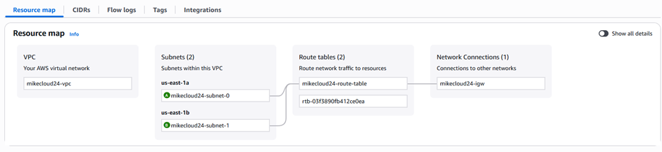

# This Repo explained the implementation of Service Mesh with istio 

Follow the steps after reading this file (service-Mesh.md):

Step 1: 

Spin up an EC2 instance (t2.medium or higher) and Set up EKS cluster using Terraform, (Repo: https://github.com/Mikecloud24/eks-terraform-project.git) 

- login to your EC2 instance and install aws cli, configure aws cli and then clone the eks-terraform repo
- cd to terraform dir
- Install Terraform and take note of the version
- initialize the terraform working dir
- apply the config files

# Setup EKS, use the EKS-Setup.md file

Step 2: 

Install Istio using istioctl  (First, forked this repo: https://github.com/Mikecloud24/istio.git )

Download and install Istio CLI: (run 1 – 3)

1.	 curl -L https://istio.io/downloadIstio | sh -
2.	 cd istio-1.26.0         # ( please update the version e.g: istio-x.x.x)
3.	 export PATH=$PWD/bin:$PATH

# Install Istio control plane and deploy the necessary resources for this project, follow the steps below:

-run this command:   

istioctl install --set profile=demo -y

This command install
1. istiod (control plane)
2. istio-ingressgateway (default gateway)

Step 3: 

Label Namespace for Auto Sidecar Injection (run 1 - 2)

1.	kubectl create ns webapps
2.	kubectl label namespace webapps istio-injection=enabled

Step 4: 

Deploy Sample App (Bookinfo) (run the apply command)

kubectl apply -f samples/bookinfo/platform/kube/bookinfo.yaml -n webapps

This command deploys:

-	productpage, details, reviews, ratings microservices

Verify the pods in webapps:

kubectl get pods -n webapps

Step 5: 

Expose App via Istio Gateway by running this command in istio-x.x.x dir:

kubectl apply -f samples/bookinfo/networking/bookinfo-gateway.yaml -n webapps

Get EXTERNAL IP:

kubectl get svc istio-ingressgateway -n istio-system

Test by browsing the ingressIP

Step 6: 

Destination Rule (routing rule):  (create a file in the ec2 (drvs.yaml), and paste the following, then apply)

Step 7: 

- Enable Observability

- Deploy addons:

- Cd to sample folder and apply the addons like below

- kubectl apply -f samples/addons

- 

check by running: 

- kubectl get all -n istio-system

Then edit Grafana and Prometheus services by running this command for both services and change the ClusterIP to LoadBalancer:

- kubectl edit svc grafana -n istio-system
- kubectl edit svc Prometheus -n istio-system

# Login to Grafana and Create a dashboard, then Integrate Prometheus

# Results:

1. Prometheus status Target health

- 

2. Grafana home dashboard showing istio resources
   
- 

4. Grafana showing istio webapps workload dashboard

- 

4. Grafana showing performance dashboard

- 

- 

# Bonus:

1. VPC Resource Map

- 

2. EKS Metrics

- 

3. EKS Cluster Info

- 

4. EKS Workload Resource Type, pods

- 

# THANK YOU...
