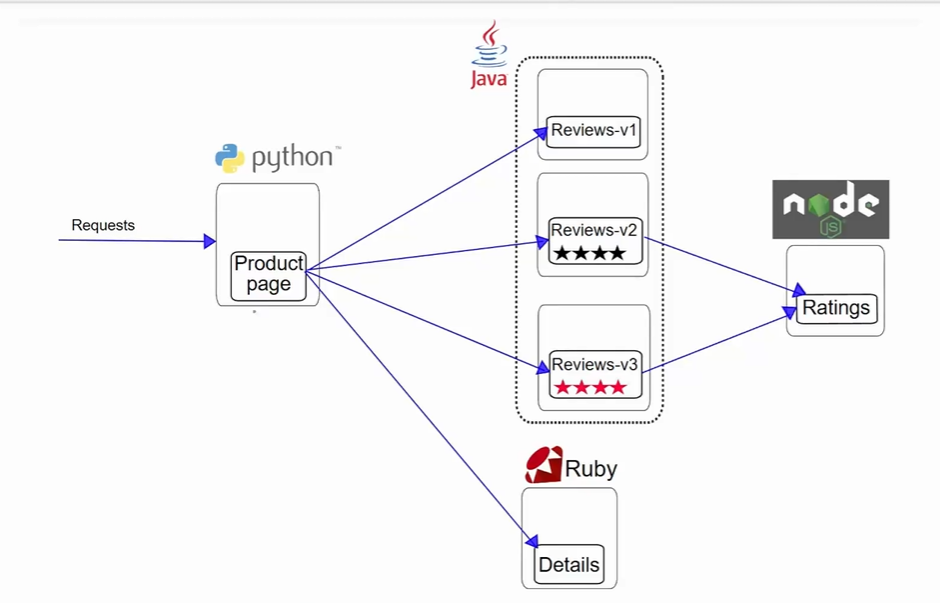

# What Is a Service Mesh?

A Service Mesh is a dedicated infrastructure layer embedded into a microservices architecture to 
manage service-to-service communication. Unlike traditional architectures where services directly 
communicate via libraries or protocols, a service mesh abstracts away the communication logic and 
pushes it into a transparent infrastructure layer. This architecture separates business logic from 
communication logic, thereby improving observability, reliability, and security. 

A) Key Points: 

- Handles traffic routing, load balancing, encryption, authentication, authorization, retries, 
failover, and observability. 
- Works alongside services, without modifying application code. 
- Operates through proxies (typically Envoy) deployed as sidecars beside each service 
instance. 

B) Real-World Example: (istio repo: https://github.com/Mikecloud24/istio.git)

In the Istio Bookinfo app (repo:istio/samples/bookinfo/platform/kube/bookinfo.yaml), there are four services: productpage, reviews, ratings, and details. Instead 
of productpage directly calling reviews via its IP, it goes through an Envoy proxy. This proxy secures 
the call with mTLS(mutual Transport Layer Security), checks if the service is allowed to talk to reviews, applies a retry if needed, and 
sends telemetry data to Prometheus—all without the productpage knowing any of this. 

# Why Do We Need a Service Mesh?

Microservices by nature introduce complexity in communication. Each microservice can scale 
independently, fail independently, and evolve independently. However, this also means you need to 
implement retry logic, load balancing, service discovery, circuit breaking, timeouts, tracing, and 
security in every service — an overwhelming and error-prone task. 

- Service Mesh comes in to offload all of this logic from developers and centralize it into a uniform 
infrastructure layer. 

A) Common Challenges Without a Service Mesh: 

- Rewriting the same retry logic in all services 
- Difficulty managing TLS certificates between services 
- No easy way to trace cross-service requests 
- Troubleshooting failures across a large mesh of services is painful 

B) Example:

- Imagine a retail platform with 50 microservices. Each one needs to do mTLS, have retries, track 
metrics, send traces, do traffic splitting for canary deployments, and gracefully degrade. Doing all this 
in application code would be a disaster. 

- With a service mesh, all this is handled by the mesh itself 
using CRDs (Custom Resource Definitions).

# Core Components of a Service Mesh

A) Service Meshes are composed of two primary planes: 

1. Control Plane – The brain. Manages configuration and policies. 
2. Data Plane – The muscle. Executes the actual traffic logic. 

- Components Explained: 

1. Control Plane (e.g., Istiod in Istio): 

-  Manages configurations like VirtualServices and DestinationRules 
-  Pushes policies to sidecars 
-  Handles certificate distribution for mTLS 
-  Aggregates telemetry 

2. Data Plane (e.g., Envoy Proxy): 

-  Intercepts incoming and outgoing service traffic 
-  Applies policies (timeouts, retries, auth) 
-  Handles routing, load balancing, traffic mirroring, etc. 

B) Example: 

In Istio, when you deploy a VirtualService to route 90% of traffic to v1 and 10% to v2 of reviews, 
Istiod pushes that config to all Envoy sidecars. When traffic flows from productpage → reviews, the 
Envoy proxy enforces that split in real-time. 

# How Sidecars Work

The Sidecar Pattern is central to the service mesh model. Instead of embedding network logic inside 
the app, the sidecar acts as an independent proxy container running next to the app container in the 
same Pod. 

Every request to and from the service is intercepted by the sidecar. This makes it possible to inject 
observability, security, routing, and fault-tolerance transparently. 

A) Key Advantages: 

- No need to modify service code 
- Offers uniformity across language stacks 
- Isolated failures (if sidecar crashes, app is still okay) 
- Dynamic policy updates from control plane 

B) Example: 

In Kubernetes, a pod running the reviews service will have:

- reviews container 
- istio-proxy container (Envoy) 

All traffic goes through the proxy. You can even configure things like circuit breakers or add retries via 
YAML—no code change.

# Security: Mutual TLS (mTLS) Deep Dive:

Security in microservices is hard. Services need to trust each other, communicate securely, and 
enforce strict identity and access control. That’s where mTLS (Mutual TLS) comes in. 
With mTLS, both the client and the server authenticate each other using certificates. It ensures 
encrypted traffic, service identity verification, and policy enforcement. 

- What Happens During mTLS: 

-  Certificates issued by Istiod are rotated regularly 
-  When service A calls service B, the sidecar encrypts the call 
-  Sidecar of B verifies identity of A using mTLS 
-  All of this is invisible to the actual application code 

- Example: 

In Bookinfo, if productpage talks to reviews, Istio’s sidecars use mTLS so the traffic is encrypted. If 
someone captures packets between pods, it will be garbage (encrypted). If reviews expects only 
productpage to talk to it, other services will be denied. 

# Traffic Management: VirtualService and DestinationRule (routing rule)

One of the most powerful features of a service mesh is intelligent traffic routing. This includes traffic 
splitting, version-based routing, A/B testing, mirroring, and gradual rollouts. 

- This is achieved using: 

1. VirtualService: Defines how traffic is routed to a service 
2. DestinationRule: Defines subsets (versions) of a service 

- Deep Mechanics: 

- VirtualService works like an Ingress inside the mesh 
- Routes can be defined based on URI, headers, cookies, etc. 
- Weight-based routing can split traffic between versions 
- Mirroring allows duplication of traffic to a version silently 
- Fault injection can simulate delays or aborts 

- Example:

From the yaml file (drvs.yaml), When someone hits reviews in virtual service, 80% goes to v1, 10% to v2, and 10% to v3. This enables canary deployments. 

# Observability: Prometheus, Grafana, Jaeger, Kiali:

You can't manage what you can't see. Service Mesh provides first-class observability into service-to
service interactions. 

- All Envoy sidecars collect metrics, logs, and traces and export them to tools like: 

1. Prometheus for metrics 
2. Grafana for dashboards 
3. Jaeger for tracing 
4. Kiali for topology visualization 

- Key Observability Features: 

1. Track request latency, error rate, throughput (RED metrics) 
2. Trace a request from service A to Z 
3. Visualize the service graph in Kiali 
4. Detect bottlenecks and failures 

- Example: 

In the Bookinfo app, when a user requests /productpage, the request goes from productpage → 
reviews → ratings. You can trace this flow in Jaeger and see which hop took how much time. 

# Resilience Features

Resilience means your app behaves gracefully under failure conditions. Service Mesh enables: 

- Timeouts: Don’t wait forever 
- Retries: Try again on failure 
- Circuit Breaking: Stop talking to a broken service 
- Fault Injection: Simulate errors and latency 

- Benefits: 

- Reduce cascading failures 
- Faster recovery 
- More graceful degradation 

- Example:

-  checkout retries.yaml file and delay.yaml file to see how you can configure retries and simulate a 2-seconds delay, which help in testing failure scenarios in staging environments.

# Gateway & Ingress

Service Mesh doesn’t only manage internal traffic. It can also expose your services to the outside 
world using Gateways. 

- IngressGateway: Like Kubernetes Ingress but with mTLS, routing, and WAF capabilities. 
- Gateway CRD: Defines port, protocol, and host configuration 
- VirtualService: Routes the external request inside the mesh 

- Example:

  - The bookinfo-gateway.yaml file exposes the mesh to external HTTP requests. 

# Advanced Concepts:

1. ServiceEntry: Allows access to external services (e.g., call api.github.com from inside mesh) 

2. EnvoyFilter: Customize Envoy behavior beyond default mesh config (e.g., add headers) 

3. WASM Filters: Add programmable plugins to Envoy using WebAssembly 

4. Multi-Cluster Mesh: Federate multiple Kubernetes clusters under one mesh 

# Summary:

A Service Mesh provides a transparent, configurable, and secure communication plane between 
microservices. It removes boilerplate logic, enhances visibility, improves resilience, and centralizes 
security—all without requiring developers to change application code. 

If microservices are the nervous system of your app, then Service Mesh is the reflex system that 
ensures those nerves are protected, observable, and resilient. 
